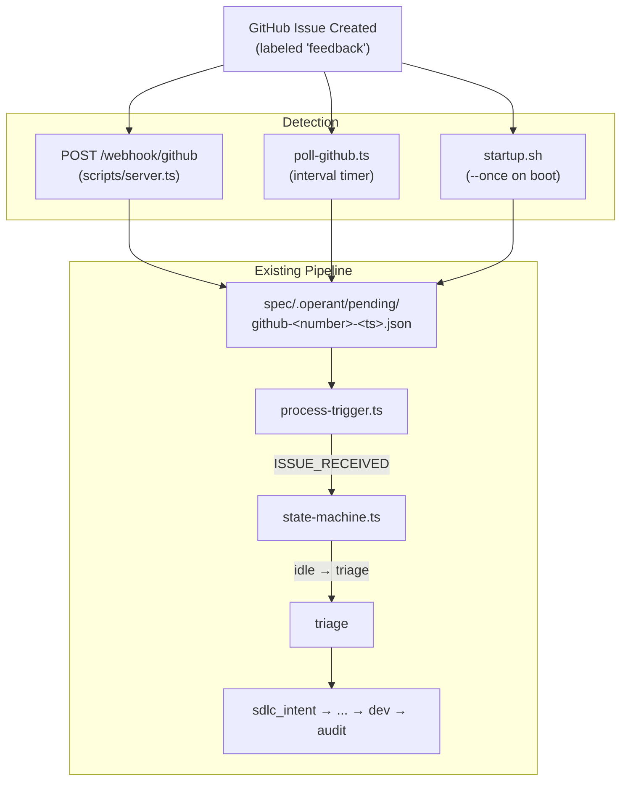

# High-Level Design: GitHub Issue Trigger Extension

**Version:** 1.1
**Date:** 2026-06-18
**Status:** Draft (Revised — OQ-1–7 resolved, Section 14 added)
**Parent:** [Intent & Constraints](intent-and-constraints.md)

---

## 1. Architecture Overview

GitHub issues enter the Operant pipeline through three redundant detection paths, all converging into the same trigger file convention used by voice calls and WhatsApp messages. From the trigger file onward, the pipeline is source-agnostic.



Key design principle: the three detection paths are **write-only** -- they produce trigger files in `pending/` and nothing else. `process-trigger.ts` is the sole consumer, and the FSM is the sole authority on state transitions. This preserves the unidirectional data flow established by the voice and WhatsApp paths.

---

## 2. Technology Choices

| Decision | Choice | Rationale (traces to) | Alternatives Considered |
|----------|--------|----------------------|------------------------|
| **HMAC validation library** | Node.js built-in `node:crypto` (`createHmac`, `timingSafeEqual`) | NFC-1 prohibits new npm packages. `crypto` provides constant-time comparison natively and matches GitHub's recommended validation pattern. | `@octokit/webhooks` (rejected: new dependency) |
| **GitHub API client for poller** | `node:https` direct HTTP with `GITHUB_TOKEN` auth header | Consistent with existing `poll-triggers.ts` which uses `node:https`. Keeps poller self-contained without child-process overhead. | `gh` CLI via `child_process.exec` (simpler auth via `gh auth`, but adds process-spawn overhead and requires `gh` binary on PATH) |
| **Webhook route placement** | Inline handler in existing `scripts/server.ts` | G-3 requires minimal changes. Server already handles voice + WhatsApp webhooks via the same pattern. Existing tunnel infrastructure (OOS-7) already exposes this server. | Separate microservice (rejected: operational complexity, extra port/tunnel) |
| **Poller architecture** | Standalone CLI script with `--once` flag, dual-mode (interval or one-shot) | Single codebase satisfies both FR-2 (continuous polling) and FR-3 (session-start check). Follows `poll-triggers.ts` structural pattern. | Two separate scripts (rejected: duplicated poll logic); cron job (rejected: no cursor state management) |
| **FSM extension strategy** | New `ISSUE_RECEIVED` event with `idle -> triage` transition. No new state. | FR-6 specifies direct entry to triage. GitHub issues have no "active call" phase, so routing through `call_active` would require synthetic events. Adding a new state would be unnecessary complexity. | Reuse `CALL_RECEIVED` + immediate `CALL_COMPLETED` (rejected: semantically misleading, adds two transitions instead of one) |
| **Transcript mapping** | Map `github_issue.body` to `raw_transcript` parameter for `classifyTranscript()` | `classifyTranscript()` is text-agnostic despite its name. Reusing it avoids forking classification logic. The 20-char threshold (FR-5) handles title-only issues. | New `classifyIssue()` function (rejected: classification logic is identical, would duplicate code) |
| **Notification channel** | Existing WhatsApp send infrastructure in `src/whatsapp.ts` | FR-7 specifies WhatsApp. Infrastructure already exists for voice-call notifications. | Email notification (rejected: not specified), Slack (rejected: not configured) |

---

## 3. FSM Changes

### New Event

Add `ISSUE_RECEIVED` to the `FSMEvent` union type in `src/state-machine.ts`:

```typescript
export type FSMEvent =
  | "CALL_RECEIVED"
  // ... existing 23 events ...
  | "ISSUE_RECEIVED";  // NEW: 24th event
```

### New Transition

Add one entry to the `TRANSITIONS` map -- a direct `idle -> triage` path:

| From | Event | To | Side Effects |
|------|-------|----|-------------|
| `idle` | `ISSUE_RECEIVED` | `triage` | `EMIT_EVENT("log", { message, issueNumber, author })` |

This is structurally analogous to the combined effect of `CALL_RECEIVED` (T1) + `CALL_COMPLETED` (T2), but collapses two transitions into one. GitHub issues have no "active call" phase -- the content is available immediately.

### Why `call_active` is skipped

The `call_active` state exists because voice calls have a temporal gap between pickup (`CALL_RECEIVED`) and hangup (`CALL_COMPLETED`). GitHub issues arrive complete -- title, body, labels are all present at creation time. Routing through `call_active` would require either (a) a synthetic `CALL_COMPLETED` event fired immediately after `CALL_RECEIVED`, or (b) new handling in `call_active` for a non-call event. Both are worse than a direct transition.

### Unchanged Invariants

- The FSM module remains pure: no `fs`, `path`, or network imports.
- All 23 existing events and their transitions are untouched.
- From `triage` onward, the pipeline is identical regardless of whether the entry event was `CALL_RECEIVED` + `CALL_COMPLETED`, or `ISSUE_RECEIVED`.

---

## 4. Webhook Handler Design

### Route: `POST /webhook/github`

Added to `scripts/server.ts` alongside the existing `/webhook/call-completed` and `/webhook/whatsapp` handlers.

### Request Processing

```
1. readRawBody(req)           -- reuse existing helper from server.ts
2. HMAC-SHA256 validation     -- X-Hub-Signature-256 header vs GITHUB_WEBHOOK_SECRET
3. Event filter               -- X-GitHub-Event must be "issues"
4. Action filter              -- payload.action must be "opened"
5. Payload extraction         -- issue.number, title, body, user.login, html_url, labels, created_at
6. Idempotency check          -- glob pending/ for github-<number>-*.json
7. Write trigger file         -- spec/.operant/pending/github-<number>-<timestamp>.json
8. Notify                     -- notifyTrigger(triggerFile) (existing filesystem notification)
```

### HMAC Validation

```typescript
import { createHmac, timingSafeEqual } from "node:crypto";

function verifyGitHubSignature(rawBody: string, signature: string, secret: string): boolean {
  const expected = "sha256=" + createHmac("sha256", secret).update(rawBody).digest("hex");
  if (expected.length !== signature.length) return false;
  return timingSafeEqual(Buffer.from(expected), Buffer.from(signature));
}
```

Uses `node:crypto` (no new dependencies, per NFC-1). The `readRawBody()` helper already exists in `server.ts` and returns the raw string needed for HMAC computation.

### Response Shapes

| Scenario | Status | Body |
|----------|--------|------|
| Valid `issues.opened` | `200` | `{ "processed": true, "issue": <number> }` |
| Non-`issues` event | `200` | `{ "ignored": true }` |
| `issues` but not `opened` | `200` | `{ "ignored": true }` |
| HMAC mismatch | `401` | `{ "error": "Invalid signature" }` |
| Missing signature header | `401` | `{ "error": "Missing signature" }` |
| Missing `GITHUB_WEBHOOK_SECRET` | `500` | `{ "error": "Webhook secret not configured" }` |

### Server Router Update

The route is registered in the `createServer` callback alongside existing routes:

```typescript
if (method === "POST" && url === "/webhook/github") {
  await handleGitHubWebhook(req, res);
  return;
}
```

On startup, the server logs the new endpoint: `POST /webhook/github`.

---

## 5. Poller Design

### New File: `src/cli/poll-github.ts`

Follows the structural pattern of `src/cli/poll-triggers.ts` (cloud-mode poller) but targets the GitHub API instead of the Operant API.

### Cursor Tracking

- **File:** `spec/.operant/github-cursor.txt`
- **Content:** A single integer -- the highest issue number already processed.
- **Default:** `0` (first run processes all matching issues).
- **Atomic write:** Write to `github-cursor.txt.tmp`, then `renameSync()` to `github-cursor.txt` (NFC-5).

### Poll Loop

```
1. Read cursor from github-cursor.txt (default 0)
2. Query: gh api /repos/{GITHUB_REPO}/issues?labels=feedback&state=open&sort=created&direction=asc
3. Filter: issue.number > cursor
4. For each new issue:
   a. Check pending/ for existing github-<number>-*.json (idempotency)
   b. If not present, write trigger file
   c. Update in-memory cursor
5. Atomic-write updated cursor to github-cursor.txt
6. Log: [poll-github] Checked at <ISO>. Found <N> new issues.
7. Sleep GITHUB_POLL_INTERVAL_MS (default 60000)
```

### GitHub API Access

Uses `node:https` with a `GITHUB_TOKEN` for authentication (consistent with `poll-triggers.ts` using `node:https`). The `gh` CLI is an alternative but adds a child-process dependency; direct HTTP keeps the poller self-contained.

Rate limit headers (`X-RateLimit-Remaining`, `X-RateLimit-Reset`) are checked on each response. A warning is logged when remaining drops below 100 (NFC-6).

### `--once` Flag

When invoked with `--once`, the poller runs a single cycle and exits with code `0`. This is used by `startup.sh` for session-start recovery (FR-3).

```typescript
const once = process.argv.includes("--once");
await pollOnce();
if (!once) setInterval(pollOnce, pollInterval);
```

---

## 6. process-trigger.ts Changes

### Source Discrimination

After parsing the trigger JSON, `process-trigger.ts` checks `payload.source`:

```typescript
const source = payload.source ?? "voice";  // backward compatible

if (source === "github") {
  // GitHub-specific entry path
} else {
  // Existing voice/WhatsApp path (unchanged)
}
```

### GitHub Entry Path

```typescript
// 1. Extract transcript equivalent
const issueBody = payload.github_issue?.body ?? "";
const issueTitle = payload.github_issue?.title ?? "";
const transcript = issueBody.length >= 20 ? issueBody : issueTitle;

// 2. Derive spec name from issue title (not transcript classification)
const specName = deriveSpecName(issueTitle);

// 3. Fire ISSUE_RECEIVED (skips call_active entirely)
const t = runTransition("ISSUE_RECEIVED", {
  issueNumber: String(payload.github_issue?.number ?? 0),
  author: payload.github_issue?.author ?? "unknown",
});

// 4. Classify and proceed through triage (same as voice path from here)
const classification = classifyTranscript(transcript);
// ... NEW_REQUIREMENTS / REJECTED logic unchanged ...
```

### REQUIREMENTS.md Content

For GitHub-sourced triggers, `REQUIREMENTS.md` includes a source reference header:

```markdown
> Source: GitHub Issue #42 -- https://github.com/owner/repo/issues/42

<issue body as requirements text>
```

### TriggerPayload Extension

The `TriggerPayload` interface in `process-trigger.ts` gains two fields:

```typescript
interface TriggerPayload {
  // ... existing fields unchanged ...
  source?: "voice" | "whatsapp" | "github";
  github_issue?: {
    number: number;
    title: string;
    body: string;
    author: string;
    url: string;
    labels: string[];
    created_at: string;
  };
}
```

Existing payloads without `source` default to `"voice"` -- full backward compatibility (NFC-3).

---

## 7. Data Flow

### End-to-End: Webhook Path

```
1. User creates issue #42 on GitHub (labeled "feedback")
2. GitHub POSTs to /webhook/github on scripts/server.ts
3. server.ts validates HMAC-SHA256 (X-Hub-Signature-256)
4. server.ts extracts: number=42, title, body, author, url, labels
5. server.ts writes: spec/.operant/pending/github-42-1718700000000.json
6. server.ts calls notifyTrigger("github-42-1718700000000.json")
7. Hook handler invokes: process-trigger.ts spec/.operant/pending/github-42-1718700000000.json
8. process-trigger.ts reads payload, detects source="github"
9. process-trigger.ts fires ISSUE_RECEIVED -> FSM transitions idle -> triage
10. classifyTranscript(issue.body) -> "requirements"
11. deriveSpecName(issue.title) -> "fix-login-button-alignment"
12. FSM fires NEW_REQUIREMENTS -> triage -> sdlc_intent
13. Side effects: CREATE_SPEC_DIR, WRITE_REQUIREMENTS
14. REQUIREMENTS.md written with issue body + source reference
15. WhatsApp notification sent (best-effort)
16. SDLC pipeline begins (intent -> hld -> adr -> eis -> dev -> audit)
```

### Trigger File Shape (written by webhook/poller/startup)

```json
{
  "source": "github",
  "github_issue": {
    "number": 42,
    "title": "Login button misaligned on mobile",
    "body": "When viewing on iPhone 14, the login button overlaps...",
    "author": "jane-doe",
    "url": "https://github.com/owner/repo/issues/42",
    "labels": ["feedback", "bug"],
    "created_at": "2026-06-18T10:30:00Z"
  },
  "created_at": "2026-06-18T10:30:05Z"
}
```

---

## 8. Configuration

### New Environment Variables

| Variable | Required | Default | Description |
|----------|----------|---------|-------------|
| `GITHUB_WEBHOOK_SECRET` | Yes (for webhook) | -- | Shared secret for HMAC-SHA256 validation |
| `GITHUB_TOKEN` | Yes (for poller) | -- | Personal access token or fine-grained token with `issues:read` |
| `GITHUB_REPO` | Yes (for poller) | -- | Target repository in `owner/repo` format |
| `GITHUB_POLL_INTERVAL_MS` | No | `60000` | Poller interval in milliseconds |

### config.ts Additions

```typescript
export function getGitHubRepo(): { owner: string; name: string } {
  const repo = process.env.GITHUB_REPO ?? "";
  const [owner, name] = repo.split("/");
  if (!owner || !name) throw new Error("GITHUB_REPO must be in owner/repo format");
  return { owner, name };
}

export function getGitHubPollInterval(): number {
  return parseInt(process.env.GITHUB_POLL_INTERVAL_MS ?? "60000", 10);
}

export function getGitHubWebhookSecret(): string | null {
  return process.env.GITHUB_WEBHOOK_SECRET ?? null;
}

export function getGitHubToken(): string | null {
  return process.env.GITHUB_TOKEN ?? null;
}
```

These follow the existing pattern in `config.ts`: thin wrappers over `process.env` with sensible defaults, loaded after the `.env` file is parsed by `loadEnvFile()`.

---

## 9. Notification Design

### WhatsApp Notification on GitHub Trigger

Uses the existing `sendTwilioMessage()` function in `src/whatsapp.ts` (local mode) or `cloudSendWhatsApp()` (cloud mode). No new WhatsApp infrastructure required.

### Message Format

```
New feedback from @jane-doe: "Login button misaligned on mobile"
Issue #42: https://github.com/owner/repo/issues/42
Starting pipeline.
```

### Send Timing

The notification is sent from `process-trigger.ts` immediately after `REQUIREMENTS.md` is written and before the SDLC pipeline begins. This mirrors the voice path's `EMIT_EVENT("secondaxis:call-completed")` timing.

### Error Handling

The notification is best-effort. A `try/catch` wraps the send call; failures are logged with `[process-trigger] WhatsApp notification failed: <message>` but do not block the pipeline (FR-7, AC-FR7-2).

---

## 10. Idempotency & Deduplication

Three mechanisms can detect the same issue. The system guarantees at-most-once processing per issue:

### Layer 1: Filename Convention

All three paths write trigger files as `github-<issue_number>-<timestamp>.json`. The issue number is the stable key; the timestamp ensures uniqueness if timing varies.

### Layer 2: Existence Check (Poller + Startup)

Before writing, the poller and startup check globs `pending/` for `github-<issue_number>-*.json`. If a match exists, the issue is skipped. This prevents the poller from duplicating a webhook-created trigger.

### Layer 3: Cursor Tracking (Poller)

`github-cursor.txt` stores the highest processed issue number. On each cycle, only issues with `number > cursor` are considered. Even if the existence check is somehow bypassed, the cursor ensures old issues are not re-queried.

### Layer 4: process-trigger.ts Move-to-Processed

After processing, `moveToProcessed()` moves the trigger file from `pending/` to `processed/`. If a second trigger file for the same issue somehow arrives, the FSM will be past `idle` and `ISSUE_RECEIVED` will throw `InvalidTransitionError`, which is caught and the file is moved to `processed/` to prevent infinite retries.

### Webhook Deduplication

The webhook does not check the cursor (it writes trigger files unconditionally). This is intentional: webhooks are configured by the repo admin and are inherently deduplicated by GitHub (each `issues.opened` event fires exactly once). The existence check in the poller handles the overlap.

---

## 11. Error Handling

| Scenario | Handler | Behavior |
|----------|---------|----------|
| HMAC signature mismatch | `handleGitHubWebhook` | Return `401`, log `[webhook/github] HMAC validation failed`, no file written |
| Missing `GITHUB_WEBHOOK_SECRET` | `handleGitHubWebhook` | Return `500`, log `[webhook/github] Webhook secret not configured` |
| GitHub API rate limit (403) | `poll-github.ts` | Log `[poll-github] Rate limited. Retrying in <interval>ms`, skip cycle, retry next interval |
| GitHub API network error | `poll-github.ts` | Log `[poll-github] Error: <message>`, skip cycle, retry next interval (matches `poll-triggers.ts` pattern) |
| Missing `GITHUB_TOKEN` | `poll-github.ts` | Log error and exit; poller cannot operate without auth |
| Missing `GITHUB_REPO` | `poll-github.ts` | Log error and exit at startup |
| Cursor file corrupted | `poll-github.ts` | `parseInt()` returns `NaN`, default to `0`, reprocess all issues (safe due to idempotency guard) |
| `issue.body` is `null` | Trigger file writer | Default to empty string `""` (FR-1 step 5) |
| FSM not in `idle` when trigger processed | `process-trigger.ts` | `InvalidTransitionError` caught, trigger moved to `processed/`, logged as skipped |
| WhatsApp notification failure | `process-trigger.ts` | Logged as warning, pipeline continues (best-effort) |

---

## 12. Testing Strategy

### Unit Tests

| Test | Module | Assertion |
|------|--------|-----------|
| `transition("idle", "ISSUE_RECEIVED")` returns `{ to: "triage" }` | `state-machine.ts` | New transition works |
| `transition("call_active", "ISSUE_RECEIVED")` throws `InvalidTransitionError` | `state-machine.ts` | Invalid transition rejected |
| All 23 existing transitions still pass | `state-machine.ts` | No regression |
| `verifyGitHubSignature()` with valid HMAC returns `true` | `server.ts` (extracted) | HMAC validation logic |
| `verifyGitHubSignature()` with tampered body returns `false` | `server.ts` (extracted) | Tamper detection |
| Payload extraction with `null` body defaults to `""` | Webhook handler | Null safety |
| Payload extraction ignores `issues.closed` action | Webhook handler | Action filtering |
| Cursor parse from file, update, atomic write | `poll-github.ts` | Cursor lifecycle |
| Idempotency guard skips existing trigger file | `poll-github.ts` | Deduplication |

### Integration Tests

| Test | Path | Assertion |
|------|------|-----------|
| Full webhook-to-REQUIREMENTS.md | Webhook + process-trigger | Issue body appears in REQUIREMENTS.md with source reference header |
| Full poller-to-REQUIREMENTS.md | Poller + process-trigger | Same as above, via poller path |
| Webhook + poller deduplication | Both paths | Only one trigger file and one pipeline run |
| `--once` flag exits after single cycle | Poller CLI | Exit code `0`, cursor file updated |

### Test Infrastructure

- Webhook handler, poller logic, and payload extraction accept dependencies (file writer, API client) as parameters for injection (NFC-8).
- FSM tests use the existing pure-function `transition()` call -- no mocking needed.
- Integration tests use a temp directory as `OPERANT_PI_DATA_DIR` to isolate filesystem state.

---

## 13. Open Questions (All Resolved)

| ID | Question | Resolution | Rationale |
|----|----------|------------|-----------|
| OQ-1 | **Which GitHub repo should the poller target?** | `GITHUB_REPO` env var set during `/operant:start`. No hardcoded default. | Fully configurable at runtime. User sets it per-project when starting the pipeline. The start command verifies it's present before launching the poller. |
| OQ-2 | **Per-repo or shared webhook secret?** | Single shared secret in `GITHUB_WEBHOOK_SECRET`. | Multi-repo is OOS-3. One secret is sufficient for one repo. |
| OQ-3 | **Should the poller also match `bug` label?** | `feedback` only. | Intentional gate — teams add `feedback` to any issue they want auto-processed. Keeps noise out of the pipeline. |
| OQ-4 | **WhatsApp notification target** | Uses existing `TWILIO_WHATSAPP_RECIPIENT` env var. | Already configured for voice-call notifications. `/operant:start` verifies it's set. No new env var needed. |
| OQ-5 | **Store issue number in spec state?** | Write `source-metadata.json` alongside `REQUIREMENTS.md`. | Zero-cost enabler for future OOS-1 (GitHub write-back). |
| OQ-6 | **Webhook label filtering?** | Webhook accepts all `issues.opened` (trusts repo admin's event config). | Asymmetry is intentional: webhook = admin-curated events, poller = must self-filter. |
| OQ-7 | **Poller dedup scope?** | Check both `pending/` and `processed/` directories. | Belt-and-suspenders with cursor. Handles edge cases (cursor corruption, fast pipeline processing). |

---

## 14. Poller Lifecycle Management

### `/operant:start` Extension

The GitHub poller runs as a long-lived background process alongside the webhook server and tunnel. Its lifecycle is managed by the same start/stop commands that manage the rest of the pipeline.

**Start sequence (appended to existing `/operant:start` steps):**

```
5. Verify GitHub env vars:
   - GITHUB_REPO (required for poller)
   - GITHUB_TOKEN (required for poller)
   - TWILIO_WHATSAPP_RECIPIENT (required for notifications)
   - GITHUB_WEBHOOK_SECRET (required for webhook endpoint)
   If any missing: log warning, skip GitHub poller (voice/WhatsApp still work)

6. Start GitHub poller:
   node $PLUGIN_ROOT/lib/cli/poll-github.js &
   Write PID to $DATA_DIR/github-poller.pid

7. Log: "GitHub issue poller started (PID: <pid>, repo: <GITHUB_REPO>)"
```

**Stop sequence (appended to existing `/operant:stop`):**

```
- Read $DATA_DIR/github-poller.pid
- If process alive: kill it
- Remove PID file
- Log: "GitHub poller stopped"
```

**Session-start recovery (`startup.sh`):**

```
- If GITHUB_TOKEN and GITHUB_REPO are set:
  Run poll-github.js --once (single cycle, exit)
  This catches issues created during downtime
```

### PID File Convention

Follows the existing pattern used by `server.pid` and `poller.pid`:
- Written immediately after `fork`/`spawn` on start
- Cleaned up on stop or by stale-PID cleanup in `startup.sh`
- Format: single line containing the process ID integer

---

## Traceability

| Intent Requirement | HLD Section | Notes |
|--------------------|-------------|-------|
| FR-1: GitHub Webhook Endpoint | 4 (Webhook Handler Design) | `handleGitHubWebhook` in `scripts/server.ts` |
| FR-2: GitHub API Polling | 5 (Poller Design) | New `src/cli/poll-github.ts` |
| FR-3: Session Start Check | 5 (Poller Design, `--once` flag) | Invoked from `scripts/startup.sh` |
| FR-4: Extended TriggerPayload | 6 (process-trigger.ts Changes) | `source` + `github_issue` fields |
| FR-5: process-trigger.ts GitHub Path | 6 (process-trigger.ts Changes) | Source discrimination, `ISSUE_RECEIVED` |
| FR-6: FSM Extension | 3 (FSM Changes) | `ISSUE_RECEIVED` event, `idle -> triage` transition |
| FR-7: WhatsApp Notification | 9 (Notification Design) | Best-effort via existing `whatsapp.ts` infrastructure |
| NFC-1: No new dependencies | 2 (Technology Choices), 4 (`node:crypto`), 5 (`node:https`) | All stdlib |
| NFC-2: Idempotency | 10 (Idempotency & Deduplication) | Four-layer deduplication |
| NFC-3: Backward compatibility | 6 (`source` defaults to `"voice"`) | Optional field |
| NFC-5: Cursor durability | 5 (Cursor Tracking, atomic write) | write-tmp-then-rename |
| NFC-6: Rate limiting awareness | 11 (Error Handling) | Log warning at < 100 remaining |
| NFC-7: Logging | 4, 5, 6 (all sections) | `[webhook/github]`, `[poll-github]`, `[startup/github]` prefixes |
| NFC-8: Testability | 12 (Testing Strategy) | Dependency injection for file writer and API client |
| FR-8: `/operant:start` and `/operant:stop` Extension | 14 (Poller Lifecycle Management) | Start/stop commands manage poller process, verify env vars |
