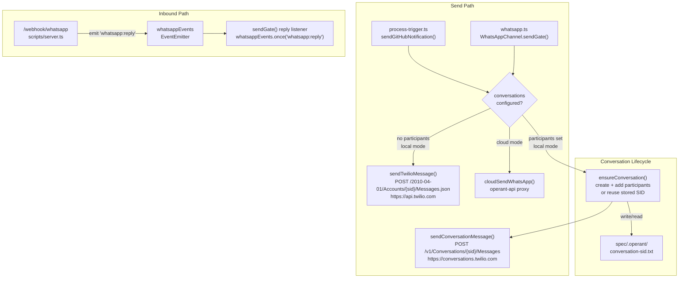

# High-Level Design: WhatsApp Group Notifications via Conversations API

**Version:** 1.0
**Date:** 2026-06-18
**Status:** Draft
**Parent:** [Intent & Constraints](intent-and-constraints.md)

---

## 1. Architecture Overview

The feature adds a group notification layer to the existing WhatsApp channel. When `OPERANT_WHATSAPP_PARTICIPANTS` is set, all sends go through a Twilio Conversation (a shared thread visible to every participant). When the variable is absent, the pipeline falls back to the existing 1:1 Messages API path without any code changes required.

The Twilio Conversations API is an additional HTTPS target. There are no new processes, no new servers, and no changes to the webhook receiver. Inbound replies continue to arrive on the existing `/webhook/whatsapp` route exactly as today because Twilio routes Conversation participant replies through the same webhook.



Key invariants preserved from the existing design:

- `scripts/server.ts` is not modified.
- `whatsappEvents` EventEmitter and `parseReply()` are reused without change.
- The first valid reply from any participant resolves the gate — no participant identity check is required.
- The fallback to 1:1 is automatic and requires zero configuration change for existing users.

---

## 2. Technology Choices

| Decision | Choice | Rationale (traces to) | Alternatives Considered |
|----------|--------|-----------------------|------------------------|
| **Conversations API transport** | `node:https` direct HTTPS calls to `https://conversations.twilio.com` | NFC-1 prohibits new npm packages. Same pattern as existing `sendTwilioMessage()` and `cloudSendWhatsApp()`. | `twilio` npm SDK (rejected: new dependency, violates NFC-1) |
| **Conversation SID storage** | Flat file `spec/.operant/conversation-sid.txt`, write-tmp-then-rename | Matches `github-cursor.txt` atomic-write pattern. Zero additional infrastructure. Survives process restarts. | Supabase / database (rejected: network dependency for local state), in-memory (rejected: lost on restart) |
| **Participant source** | `OPERANT_WHATSAPP_PARTICIPANTS` env var (comma-separated `+<number>` list) | Single source of truth, consistent with all other Operant config. Complements existing whitelist.json (participants can overlap). | Parse `whitelist.json` directly (rejected: whitelist is conceptually about trusted senders, not about notification recipients — conflating the two creates confusion) |
| **Conversation reuse strategy** | Fetch-then-create with SID validation on startup | One conversation per pipeline installation, reused indefinitely. Avoids Twilio Conversations object accumulation. | Create-new-per-session (rejected: clutters Twilio account, breaks persistent group thread) |
| **Inbound reply routing** | Unchanged — all Conversation participant replies arrive on `/webhook/whatsapp` | Twilio Conversations API routes all participant messages to the same webhook URL already configured. No server changes needed. | Separate `/webhook/whatsapp/conversation` route (rejected: unnecessary, Twilio routes both 1:1 and Conversation replies to the same endpoint) |
| **Cloud mode handling** | Group send is local-only; cloud mode continues via `cloudSendWhatsApp()` proxy | Cloud mode goes through `operant-api`, which manages its own send logic. Adding Conversations API to the cloud path requires API server changes (out of scope for this feature). | Add Conversations support to `operant-api` (rejected: out of scope per OOS-3 interpretation; cloud mode users can still use multi-recipient via server-side logic) |
| **Gate reply disambiguation** | First-reply-wins via `whatsappEvents.once()` | Existing `.once()` semantics already deduplicate: after the first `whatsapp:reply` event the listener is removed. Subsequent replies are silently discarded. | Named-participant tracking (rejected: over-engineering — the once listener already achieves the desired AC-FR4-3) |

---

## 3. Conversation Lifecycle Design

### State Machine

A conversation has three observable states from the pipeline's perspective:

```
UNCONFIGURED  ->  PROVISIONED  ->  ACTIVE (reused)
     |                |
  (no SID)      (SID on disk)
                      |
                 RECREATED (if SID invalid)
```

### `ensureConversation()` Function

This is the central lifecycle function. It is called by both `sendConversationMessage()` (in `whatsapp.ts`) and the analogous send path in `process-trigger.ts`.

```
1. Read conversation-sid.txt from data dir
2. If SID exists:
   a. GET /v1/Conversations/{sid} on conversations.twilio.com
   b. If 200 OK -> return SID (fast path)
   c. If 404 -> log "[whatsapp] Conversation {sid} not found, recreating"
                clear stored SID, fall through to creation
3. POST /v1/Conversations with FriendlyName="Operant Pipeline Notifications"
   and MessagingServiceSid=TWILIO_MESSAGING_SERVICE_SID (if set)
   or omit MessagingServiceSid for sandbox
4. Atomic-write new SID to conversation-sid.txt
5. For each participant in getWhatsAppParticipants():
   a. POST /v1/Conversations/{sid}/Participants
      body: messagingBinding.address=whatsapp:+<number>
            messagingBinding.proxyAddress=whatsapp:<TWILIO_WHATSAPP_NUMBER>
   b. On HTTP 409 (Conflict / participant already exists): log and continue
   c. On other 4xx/5xx: log warning, continue (partial failure is acceptable)
6. Return SID
```

### `getConversationSid()` / `writeConversationSid()` in config.ts

Following the exact pattern of `readState()` / `writeState()`:

- `getConversationSid()`: reads `{dataDir}/conversation-sid.txt`, returns `null` if missing or empty
- `writeConversationSid(sid)`: atomic write — write to `conversation-sid.txt.tmp`, then `renameSync` to `conversation-sid.txt`

---

## 4. Data Flow

### Notification Send (Group Path)

```
1. Pipeline calls sendNotification() or sendGate() with a message body
2. getWhatsAppParticipants() returns non-empty array  ->  group path selected
3. ensureConversation() called:
   a. SID on disk  ->  validate via GET  ->  reuse
   b. No SID or invalid SID  ->  create  ->  add participants  ->  write SID
4. POST https://conversations.twilio.com/v1/Conversations/{sid}/Messages
   body: { Body: "<message text>", Author: "operant" }
5. Twilio delivers message to every Conversation participant's WhatsApp
6. Log: [whatsapp] Sent to conversation {sid} ({N} participants)
```

### Gate Reply (Any Participant)

```
1. Participant receives gate message in their WhatsApp
2. Participant replies "1" (or any valid response)
3. Twilio POSTs to /webhook/whatsapp (same endpoint as 1:1 replies)
4. server.ts emits whatsappEvents.emit("whatsapp:reply", { fromNumber, body, ... })
5. WhatsAppChannel.sendGate() has whatsappEvents.once("whatsapp:reply") registered
6. First emission resolves the Promise<GateReply>
7. Listener is automatically removed (.once semantics)  ->  second reply is a no-op
```

### Fallback Path (No Participants Configured)

```
1. getWhatsAppParticipants() returns []
2. Local mode  ->  sendTwilioMessage() called with TWILIO_WHATSAPP_RECIPIENT (unchanged)
3. Cloud mode  ->  cloudSendWhatsApp() called (unchanged)
```

---

## 5. Configuration

### New Environment Variables

| Variable | Required | Default | Description |
|----------|----------|---------|-------------|
| `OPERANT_WHATSAPP_PARTICIPANTS` | No | `""` | Comma-separated list of participant phone numbers in `+<country><number>` format. Example: `+14155550001,+14155550002`. When empty, falls back to 1:1 mode. |
| `TWILIO_MESSAGING_SERVICE_SID` | No | `""` | Twilio Messaging Service SID (`MG...`) to associate with the Conversation. Required for production WhatsApp Business; omit for sandbox use. |

### Existing Variables Reused Without Change

| Variable | Role in this Feature |
|----------|---------------------|
| `TWILIO_ACCOUNT_SID` | Auth for Conversations API (same Basic auth as Messages API) |
| `TWILIO_AUTH_TOKEN` | Auth for Conversations API |
| `TWILIO_WHATSAPP_NUMBER` | `messagingBinding.proxyAddress` when adding participants |
| `TWILIO_WHATSAPP_RECIPIENT` | 1:1 fallback recipient when `OPERANT_WHATSAPP_PARTICIPANTS` is unset |

### config.ts Additions

```typescript
export function getWhatsAppParticipants(): string[] {
  const raw = process.env.OPERANT_WHATSAPP_PARTICIPANTS ?? "";
  if (!raw.trim()) return [];
  return raw.split(",").map((n) => n.trim()).filter(Boolean);
}

export function getConversationSid(): string | null {
  const path = join(getDataDir(), "conversation-sid.txt");
  try {
    const raw = readFileSync(path, "utf-8").trim();
    return raw.length > 0 ? raw : null;
  } catch {
    return null;
  }
}

export function writeConversationSid(sid: string): void {
  const dataDir = getDataDir();
  mkdirSync(dataDir, { recursive: true });
  const tmpPath = join(dataDir, "conversation-sid.txt.tmp");
  const finalPath = join(dataDir, "conversation-sid.txt");
  writeFileSync(tmpPath, sid + "\n");
  renameSync(tmpPath, finalPath);
}
```

All three functions follow the established getter pattern with no side-effects beyond the atomic-write helper.

---

## 6. whatsapp.ts Changes

### New Top-Level Functions

Three new functions are added to `src/whatsapp.ts`. They are module-private (no `export`) except where called from `process-trigger.ts`.

#### `callConversationsApi()`

Low-level HTTPS helper for the `conversations.twilio.com` base, matching the structure of `sendTwilioMessage()`:

```typescript
function callConversationsApi(
  accountSid: string,
  authToken: string,
  method: "GET" | "POST",
  path: string,
  body?: Record<string, string>,
): Promise<{ status: number; data: Record<string, unknown> }>
```

- Uses `node:https` with Basic auth (`accountSid:authToken`).
- `POST` requests encode the body as `application/x-www-form-urlencoded` (same as `sendTwilioMessage`).
- Returns `{ status, data }` so callers can inspect HTTP status for idempotency checks (409 = already exists).

#### `ensureConversation()`

Lifecycle function described in Section 3. Returns the active conversation SID as a `Promise<string>`.

```typescript
async function ensureConversation(
  accountSid: string,
  authToken: string,
  whatsappNumber: string,
  participants: string[],
): Promise<string>
```

#### `sendConversationMessage()`

Single-purpose send function:

```typescript
async function sendConversationMessage(
  accountSid: string,
  authToken: string,
  conversationSid: string,
  body: string,
): Promise<void>
```

Posts to `POST /v1/Conversations/{conversationSid}/Messages` with `Body=<body>&Author=operant`.

### Changes to `sendGate()`

The existing `sendGate()` method in `WhatsAppChannel` gains a branch before the existing local-mode path:

```typescript
// Group send path (local mode, participants configured)
const participants = getWhatsAppParticipants();
if (getMode() === "local" && participants.length > 0) {
  const cfg = getConfig();
  this.log(`[whatsapp] Sending ${context.mode} gate to conversation (${participants.length} participants)`);
  const sid = await ensureConversation(cfg.accountSid, cfg.authToken, cfg.whatsappNumber, participants);
  await sendConversationMessage(cfg.accountSid, cfg.authToken, sid, body);
  // Reply listener is identical for both paths
  return new Promise<GateReply>((resolve) => { /* same .once handler */ });
}
// ... existing cloud and 1:1 local paths unchanged ...
```

### New Exported Helper: `sendGroupNotification()`

Used by `process-trigger.ts` for trigger-received notifications (mirrors the role of `sendGitHubNotification` but uses the Conversations path when configured):

```typescript
export async function sendGroupNotification(message: string): Promise<void>
```

This function:
1. Calls `getWhatsAppParticipants()`.
2. If non-empty: calls `ensureConversation()` + `sendConversationMessage()`.
3. If empty: calls `sendTwilioMessage()` with the existing 1:1 config (same fallback as today).
4. Wraps everything in `try/catch`; failures are logged and swallowed.

---

## 7. process-trigger.ts Changes

The existing `sendGitHubNotification()` function is replaced by a call to `sendGroupNotification()` from `whatsapp.ts`. This eliminates the inline Twilio HTTPS code that is duplicated there today.

### Before

```typescript
import https from "node:https";
// ... inline params/auth/request construction ...
await new Promise<void>((resolve, reject) => { /* 30 lines */ });
```

### After

```typescript
import { sendGroupNotification } from "../whatsapp.js";
// ...
await sendGroupNotification(msg);
```

The message format is unchanged. The routing decision (group vs. 1:1) moves inside `sendGroupNotification()`.

---

## 8. Notification Design

### Message Formats

All existing message formats (`formatGateMessage()`) are delivered unchanged to the Conversation. The `Body` field in the Conversations API call receives the same string that today goes to the Messages API.

### Trigger-Received Notification

```
New feedback from @<author>: "<issue title>"
Issue #<N>: <url>
Starting pipeline.
```

Delivered to conversation (group) or to `TWILIO_WHATSAPP_RECIPIENT` (1:1 fallback).

### Gate Request (review / confirmation / demo_invite)

```
*REVIEW: <specName>*
Artifact: HLD
...
---
Reply *1* to APPROVE
Reply *2* to REJECT (include feedback)
```

All participants see the same message. First reply wins.

### Confirmation Message

After a gate is resolved, no additional "result" message is sent to the conversation — this matches current behavior where the gate reply itself closes the loop.

---

## 9. Gate Reply Handling

The inbound reply path is **completely unchanged**. The key insight from FR-4 is that Twilio routes Conversation participant replies to the same webhook URL as 1:1 replies. The webhook payload shape (`From`, `Body`, `AccountSid`) is identical.

`whatsappEvents.once("whatsapp:reply", handler)` already handles the first-wins deduplication: `.once()` unregisters the listener after the first emission. If a second participant replies after the gate is resolved, the event is emitted but has no listener — it is silently discarded.

No changes to `scripts/server.ts`, `parseReply()`, or `whatsappEvents`.

---

## 10. Fallback Logic

```
Is OPERANT_WHATSAPP_PARTICIPANTS non-empty?
  No  ->  use TWILIO_WHATSAPP_RECIPIENT (1:1, unchanged)
  Yes ->  Is mode cloud?
            Yes  ->  use cloudSendWhatsApp() (cloud proxy, unchanged)
            No   ->  use ensureConversation() + sendConversationMessage() (group path)
                       If ensureConversation() throws:
                         log "[whatsapp] Conversations API error: <message>, falling back to 1:1"
                         call sendTwilioMessage() with TWILIO_WHATSAPP_RECIPIENT
                         (pipeline continues)
```

The fallback-on-error behavior (intent FR-5, AC-FR5-2) is implemented as a `try/catch` inside `sendGroupNotification()` and inside `sendGate()`: any `ensureConversation()` or `sendConversationMessage()` failure falls through to the 1:1 path.

---

## 11. Error Handling

| Scenario | Handler | Behavior |
|----------|---------|----------|
| `OPERANT_WHATSAPP_PARTICIPANTS` not set | `getWhatsAppParticipants()` | Returns `[]`; caller uses 1:1 path |
| `conversation-sid.txt` missing on first run | `getConversationSid()` | Returns `null`; `ensureConversation()` creates new conversation |
| GET conversation returns 404 (deleted) | `ensureConversation()` | Log warning, clear cached SID, create new conversation |
| POST /Conversations returns 4xx | `ensureConversation()` | Throw `Error("Conversations API error <status>: ...")`; caller falls back to 1:1 |
| POST /Participants returns 409 (already exists) | `ensureConversation()` | Log "[whatsapp] Participant already in conversation, skipping"; continue |
| POST /Participants returns other 4xx | `ensureConversation()` | Log warning, continue (partial failure: other participants still receive messages) |
| POST /Messages returns 4xx | `sendConversationMessage()` | Throw; caller's `try/catch` falls back to 1:1 |
| `TWILIO_ACCOUNT_SID` / `TWILIO_AUTH_TOKEN` missing | `getConfig()` | Throws (existing behavior); notification skipped, pipeline continues |
| `conversation-sid.txt.tmp` write fails | `writeConversationSid()` | Throws; conversation was created on Twilio but SID not cached — next invocation will recreate (acceptable: idempotent, costs one extra API call) |
| Network timeout on Conversations API | `callConversationsApi()` | `req.on("error")` triggers; rejects Promise; caller falls back to 1:1 |

Log prefix for all new log lines: `[whatsapp]` (consistent with existing lines in `whatsapp.ts`).

---

## 12. Testing Strategy

### Unit Tests

| Test | Module | Assertion |
|------|--------|-----------|
| `getWhatsAppParticipants()` with populated env var parses numbers correctly | `config.ts` | Returns array of trimmed strings |
| `getWhatsAppParticipants()` with empty env var returns `[]` | `config.ts` | Fallback path selected |
| `getConversationSid()` returns `null` when file absent | `config.ts` | No throw |
| `writeConversationSid()` writes atomically (tmp then rename) | `config.ts` | File content correct after write |
| `callConversationsApi()` encodes body as `application/x-www-form-urlencoded` | `whatsapp.ts` | Correct `Content-Type` header |
| `callConversationsApi()` returns `{ status: 409, data: ... }` without throwing | `whatsapp.ts` | Caller can inspect 409 |
| `ensureConversation()` reuses SID when GET returns 200 | `whatsapp.ts` | No POST to `/Conversations` |
| `ensureConversation()` recreates when GET returns 404 | `whatsapp.ts` | POST to `/Conversations` issued, new SID written |
| `ensureConversation()` skips participant on 409 | `whatsapp.ts` | No throw; other participants added |
| `sendGroupNotification()` falls back to 1:1 when `ensureConversation()` throws | `whatsapp.ts` | `sendTwilioMessage()` called |
| `sendGroupNotification()` uses 1:1 path when participants list is empty | `whatsapp.ts` | `ensureConversation()` not called |

### Integration Tests

| Test | Path | Assertion |
|------|------|-----------|
| Full group notification flow | `process-trigger.ts` + `whatsapp.ts` | Conversations API called with correct SID; SID persisted to file |
| SID reuse across two calls | `whatsapp.ts` | GET called once, POST `/Messages` called twice, POST `/Conversations` called once |
| Fallback on Conversations API failure | `whatsapp.ts` | Messages API (1:1) called after Conversations API throws |
| Existing 1:1 path unaffected when no participants set | `whatsapp.ts` | Conversations API never called; Messages API called with `TWILIO_WHATSAPP_RECIPIENT` |

### Test Infrastructure

- `callConversationsApi()` accepts an optional `httpClient` parameter (dependency injection) so unit tests can stub the HTTPS layer without network calls.
- `ensureConversation()` accepts `getSid` / `writeSid` callbacks (defaulting to `getConversationSid` / `writeConversationSid`) for filesystem isolation.
- Tests that need filesystem state use a temp directory as `OPERANT_PI_DATA_DIR`.

---

## 13. Open Questions

| ID | Question | Default Recommendation | Alternatives |
|----|----------|----------------------|--------------|
| OQ-1 | **Should `ensureConversation()` be called eagerly on `/operant:start` or lazily on first send?** | **Lazy (on first send).** Avoids creating orphan conversations if the pipeline never actually sends a WhatsApp message in a session. The SID is reused across sessions anyway, so the cost of first-call creation is paid exactly once. | Eager on start: pre-validates credentials at startup cost; less surprising in error reporting. |
| OQ-2 | **Should the conversation SID be scoped per-project (in `spec/.operant/`) or global (in `~/.operant/`)?** | **Per-project (`spec/.operant/`).** Matches where all other pipeline state lives. Different projects may have different participant lists. | Global: single Conversation for all projects; participants receive notifications from all pipelines on a machine — likely noisy. |
| OQ-3 | **What `FriendlyName` to use when creating the Conversation?** | **`"Operant Pipeline Notifications"`** plus the project directory basename (e.g., `"Operant Pipeline - my-project"`). Helps identify the conversation in the Twilio console when multiple projects are used. | Static name only: simpler but harder to distinguish in Twilio console. |
| OQ-4 | **Should `TWILIO_MESSAGING_SERVICE_SID` be required for non-sandbox setups?** | **Optional with a clear warning.** If absent and not using the sandbox, Twilio may reject the Conversation creation. Log `[whatsapp] TWILIO_MESSAGING_SERVICE_SID not set; Conversation creation may fail outside sandbox.` | Required for non-sandbox: safer but adds friction for sandbox-only users. |
| OQ-5 | **Should removing a number from `OPERANT_WHATSAPP_PARTICIPANTS` remove them from the Conversation?** | **No (add-only).** Removing a Twilio Conversations participant requires knowing their participant SID, which we don't cache. Users can remove manually via Twilio console. Implementing removal adds SID-tracking complexity for minimal benefit at MVP. | Yes: cache participant SIDs alongside the conversation SID; remove on list diff. Enables self-service cleanup but is out of scope for this feature. |
| OQ-6 | **Cloud mode: should group send be supported via the `operant-api` proxy?** | **No (deferred).** Cloud mode participants go through `operant-api`, which would need its own Conversations API integration. Implementing it in this feature would require server-side changes. Cloud mode users retain 1:1 notifications. | Add a `/api/whatsapp/send-group` endpoint to `operant-api`: full parity but doubles the scope; tracked as a follow-on. |

---

## 14. Traceability

| Intent Requirement | HLD Section | Notes |
|--------------------|-------------|-------|
| G-1: Group delivery of all pipeline notifications | 4 (Data Flow), 6 (whatsapp.ts Changes), 8 (Notification Design) | `sendGroupNotification()` + `sendGate()` group branch |
| G-2: Any participant can approve/reject gates | 9 (Gate Reply Handling) | `whatsappEvents.once()` picks up first reply from any participant |
| G-3: 1:1 fallback when Conversations not configured | 10 (Fallback Logic), 6 (`sendGroupNotification()`) | Empty participants list routes to existing `sendTwilioMessage()` |
| G-4: One-time conversation creation, subsequent reuse | 3 (Conversation Lifecycle), 5 (Configuration) | `ensureConversation()` + `conversation-sid.txt` |
| FR-1: Conversation lifecycle management | 3 (Conversation Lifecycle Design) | `ensureConversation()` creates, validates, recreates |
| FR-1 AC-FR1-1: First notification creates and persists SID | 3, 5 (`writeConversationSid()`) | Atomic write on creation |
| FR-1 AC-FR1-2: Subsequent notifications reuse SID | 3 (`ensureConversation()` fast path) | GET validates, returns cached SID |
| FR-1 AC-FR1-3: Invalid SID triggers recreation | 3 (404 handling), 11 (Error Handling) | GET 404 -> clear -> create |
| FR-2: Participant management | 3 (`ensureConversation()` step 5), 5 (`getWhatsAppParticipants()`) | Add-on-create; 409 idempotency |
| FR-2 AC-FR2-2: Re-adding is idempotent | 11 (Error Handling, 409 row) | HTTP 409 logged and skipped |
| FR-3: Send notification to Conversation | 4 (Data Flow), 6 (`sendConversationMessage()`) | POST /v1/Conversations/{sid}/Messages |
| FR-3 AC-FR3-2: Gate messages include structured reply options | 8 (Notification Design) | `formatGateMessage()` unchanged |
| FR-4: Gate reply handling | 9 (Gate Reply Handling) | No server.ts changes; `.once()` deduplication |
| FR-4 AC-FR4-3: Second reply ignored | 9 | `.once()` semantics |
| FR-5: Graceful fallback | 10 (Fallback Logic), 11 (Error Handling) | Empty list and error-path both route to 1:1 |
| FR-5 AC-FR5-1: Existing 1:1 setup unchanged | 6, 10 | Participants empty -> existing code path |
| FR-5 AC-FR5-2: Failure does not block pipeline | 10, 11 | `try/catch` + fallback in `sendGroupNotification()` |
| NFC-1: No new npm dependencies | 2 (Technology Choices) | `node:https` for all Conversations API calls |
| NFC-2: Backward compatible | 10 (Fallback Logic), 7 (process-trigger.ts Changes) | Empty participants = existing behavior |
| NFC-3: Idempotent participant management | 3 (step 5c), 11 (409 row) | HTTP 409 swallowed |
| NFC-4: SID persistence (atomic write) | 5 (`writeConversationSid()`), 3 | write-tmp-then-rename |
| NFC-5: Twilio Sandbox compatible | 5 (`TWILIO_MESSAGING_SERVICE_SID` optional), 13 (OQ-4) | Sandbox works without MessagingServiceSid |
